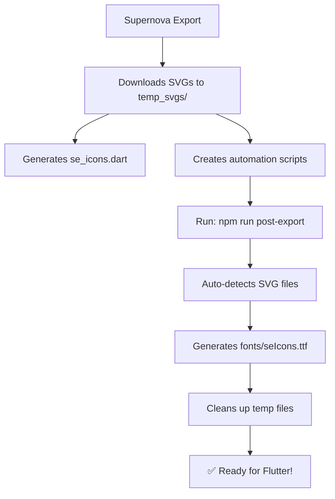

# Flutter Icons Exporter

A Supernova.io exporter that converts SVG icons from your design system into a TTF font file with a corresponding Dart file for Flutter applications. **Now with full automation support!**

## ✨ Features

- ✅ Exports SVG icons from Supernova.io design system
- ✅ Converts SVG assets to TTF font file
- ✅ Generates Flutter-compatible Dart file with IconData constants
- ✅ Automatic codepoint mapping (starting from 0xe900)
- ✅ Sorted icon names for consistency
- ✅ **Automated font generation workflow**
- ✅ **CI/CD integration ready**
- ✅ **Zero manual steps required**

## 🚀 Automated Workflow

### Quick Start (Fully Automated)

1. **Run Supernova Export** (generates SVGs + automation scripts)
2. **Auto-generate font**: `npm run post-export`
3. **Done!** Font and Dart files ready for Flutter

### Setup Automation (One Time)

The exporter automatically generates these scripts:

- `generate_font.js` - Core font generation
- `auto_generate_font.js` - Smart automation wrapper  
- `AUTOMATION_SETUP.md` - Complete setup instructions

**Package.json scripts (auto-added):**
```json
{
  "scripts": {
    "generate-font": "node generate_font.js",
    "auto-font": "node auto_generate_font.js", 
    "post-export": "npm run auto-font"
  }
}
```

## 📁 Generated Files

After running the Supernova exporter, you get:

### Core Output
- ✅ `se_icons.dart` - Flutter IconData constants
- ✅ `fonts/seIcons.ttf` - TTF font file (after automation runs)
- ✅ `temp_svgs/` - SVG assets from design system

### Automation Scripts
- ✅ `generate_font.js` - Font generation script
- ✅ `auto_generate_font.js` - Smart automation workflow
- ✅ `AUTOMATION_SETUP.md` - Detailed setup instructions

## 🔄 How Automation Works



## 🛠️ Usage Options

### Option 1: Fully Automated (Recommended)
```bash
# After Supernova export, run:
npm run post-export
```
**Result**: Font generated automatically, temp files cleaned up

### Option 2: Manual Control
```bash
# Generate font manually:
npm run generate-font

# Or run automation wrapper:
npm run auto-font
```

## 🏗️ CI/CD Integration

### GitHub Actions Example
```yaml
- name: Export from Supernova
  run: # Your Supernova export command
  
- name: Generate Icons Font
  run: npm run post-export
  
- name: Commit Font Files
  run: |
    git add fonts/ se_icons.dart
    git commit -m "Update icon font"
```

### Webhook Integration
Configure your Supernova webhook to trigger:
```bash
npm run post-export
```

## 📱 Flutter Integration

1. **Add font to `pubspec.yaml`**:
```yaml
flutter:
  fonts:
    - family: seIcons
      fonts:
        - asset: fonts/seIcons.ttf
```

2. **Copy files to Flutter project**:
   - `fonts/seIcons.ttf` → `fonts/`
   - `se_icons.dart` → `lib/`

3. **Use icons in code**:
```dart
import 'se_icons.dart';

// Use anywhere
Icon(SEIcons.iconName)
Widget build(context) => Icon(SEIcons.arrowBack)
```

## ⚙️ Configuration

### Icon Filtering
The exporter processes icons that:
- ✅ Have SVG URLs available
- ✅ Originate from paths starting with `Icons/`
- ✅ Match selected brand (if brand filtering enabled)

### Naming Convention
Icons are automatically converted to camelCase:
- `Arrow/Back` → `arrowBack`
- `User Profile` → `userProfile`  
- `Navigation/Menu` → `navigationMenu`
- Duplicates get numbered: `icon1`, `icon2`

### Codepoint Assignment
- **Starting point**: `0xe900` (Unicode Private Use Area)
- **Incremental**: Each icon gets next available codepoint
- **Consistent**: Same icon = same codepoint across exports

## 🔧 Development

### Building the Exporter
```bash
npm run build
```

### Development Mode
```bash
npm run dev
```

## 📦 Dependencies

### Core
- `@supernovaio/export-helpers` - Supernova.io utilities
- `@supernovaio/sdk-exporters` - Supernova.io SDK

### Font Generation
- `svgtofont` - SVG to font conversion
- `rimraf` - Cleanup utilities

## 🗂️ File Structure

```
FlutterIconsExporter/
├── src/
│   └── index.ts              # Main exporter logic
├── fonts/                    # Generated TTF fonts
├── temp_svgs/               # Temporary SVG files (auto-cleaned)
├── se_icons.dart            # Generated Flutter constants
├── generate_font.js         # Font generation script
├── auto_generate_font.js    # Automation wrapper
├── AUTOMATION_SETUP.md      # Detailed instructions
└── package.json            # NPM scripts for automation
```

## ⚡ Benefits of Automation

| Manual Process | Automated Process |
|---------------|------------------|
| ❌ Run export | ✅ Run export |
| ❌ Run font script manually | ✅ **Automatic font generation** |
| ❌ Clean up temp files | ✅ **Auto cleanup** |
| ❌ Remember multiple steps | ✅ **Single command** |
| ❌ CI/CD complexity | ✅ **Simple integration** |

## 🐛 Troubleshooting

### Common Issues

**"No SVG files found"**
- ✅ Ensure Supernova export completed successfully
- ✅ Check that icons start with `Icons/` path in Supernova

**"Permission errors"**
- ✅ Verify write permissions for `fonts/` directory
- ✅ Run with appropriate user permissions

**"svgtofont not found"**
- ✅ Install dependencies: `npm install`
- ✅ Verify `svgtofont` in package.json

**"Font not showing in Flutter"**
- ✅ Check `pubspec.yaml` font configuration
- ✅ Verify TTF file path is correct
- ✅ Run `flutter clean && flutter pub get`

### Debug Mode
```bash
# Run with verbose output
DEBUG=1 npm run post-export
```

## 🎯 Next Steps

1. **Set up automation**: Follow `AUTOMATION_SETUP.md`
2. **Test workflow**: Run `npm run post-export` 
3. **Integrate CI/CD**: Add to your build pipeline
4. **Use in Flutter**: Copy font and Dart files to your project

---

**Need help?** Check the generated `AUTOMATION_SETUP.md` file for detailed setup instructions and troubleshooting guides.